# Mục lục
1. [Khái niệm về tracing](#distributed-tracing-là-gì?)
2. [Sơ qua về Opentelemetry](#otel-opentelemetry)
3. [Tích hợp vào K8S (sử dụng auto-instrumentation)](#tích-hợp-vào-k8s-sử-dụng-auto-instrumentation)
    - [Thông tin về ứng dụng](#thông-tin-về-ứng-dụng)
    - [Thiết lập các công cụ](#thiết-lập-các-công-cụ)
    - [Khởi chạy ứng dụng](#khởi-chạy-ứng-dụng)
4. [Kiểm tra traces, metrics qua Grafana](#kiểm-tra-traces-metrics-qua-grafana)
5. [Troubleshooting](#troubleshooting)
6. [Kết luận](#kết-luận)


# Truy vết ứng dụng microservice (tracing) trên K8S cluster sử dụng Opentelemetry


## Distributed Tracing là gì?

**Distributed tracing (truy vết phân tán)** là phương pháp theo dõi hành trình của một **request** từ frontend đến các backend services và database trong hệ thống. Nó cho phép lập trình viên phân tích các request có độ trễ cao hoặc gặp lỗi, theo dõi đường đi của 1 transaction hoàn chỉnh giúp xác định chính xác điểm nghẽn hoặc service gây sự cố.

---

## Cách hoạt động của Distributed Tracing

- Trong kiến trúc **monolith**, việc tracking thường đơn giản do tất cả xử lý nằm trong cùng một khối.
- Trong kiến trúc **microservice**, một request có thể đi qua nhiều service khác nhau → việc theo dõi trở nên phức tạp hơn.

### Cơ chế hoạt động:
1. Khi user thực hiện một hành động (ví dụ: submit form), một **trace ID** được tạo ra cùng với **span cha (parent span)**.
2. Mỗi khi request đi vào 1 service, một **child span** được sinh ra (và có thể chứa nhiều span con bên trong).
3. Mỗi span bao gồm:
   - `trace_id` (để liên kết với trace chính),
   - `span_id` (định danh riêng),
   - thời gian thực thi,
   - lỗi (nếu có),
   - metadata (user ID, IP, v.v.).

4. Cuối cùng, các span được trình bày dưới dạng **flame graph** giúp dev phân tích dễ dàng các vấn đề về hiệu suất.

> [https://opentelemetry.io/docs/concepts/signals/traces/](https://opentelemetry.io/docs/concepts/signals/traces/)
---

## Lợi ích của Distributed Tracing

- ✅ **Giảm thời gian phát hiện và khắc phục sự cố (MTTD / MTTR)**: nhanh chóng tìm ra điểm lỗi trong backend hoặc frontend.
- ✅ **Hiểu rõ mối quan hệ giữa các service**: xác định nguyên nhân dây chuyền (ví dụ: DB chậm làm API upstream chậm theo).
- ✅ **Đo thời gian thực hiện các hành động của người dùng**: ví dụ, đo thời gian đặt hàng từ khi click đến khi hoàn tất.
- ✅ **Cải thiện cộng tác giữa các team**: dễ xác định service nào lỗi → team nào chịu trách nhiệm.
- ✅ **Đảm bảo tuân thủ SLA**: đánh giá hiệu suất dịch vụ theo cam kết chất lượng (Service Level Agreement).

---

## Thách thức khi triển khai Distributed Tracing

- ❌ **Manual Instrumentation**: một số hệ thống yêu cầu chèn mã tay → tốn thời gian, dễ sai sót.
- ❌ **Chỉ bao phủ backend**: nếu không có end-to-end tracing, sẽ không thấy được frontend → khó xác định root cause.
- ❌ **Khối lượng dữ liệu lớn**: hệ thống lớn có thể sinh ra **hàng triệu spans/phút**, gây khó khăn khi lọc thông tin quan trọng.

---

## Các công cụ Distributed Tracing phổ biến

### 🛠️ 1. OpenTelemetry (Otel)
- **Observability Framework tiêu chuẩn**.
- Hỗ trợ **instrumentation + thu thập dữ liệu** cho traces, metrics, logs.
- **Không có UI** tích hợp → cần tích hợp thêm Jaeger, Zipkin, Tempo, v.v.

### 🛠️ 2. Zipkin & Jaeger
- Open source, có UI trực quan cho trace.
- Nhược điểm: **sampling-based** → có thể bỏ sót lỗi/trace quan trọng.

### 🛠️ 3. Datadog APM
- Trọn bộ tính năng tracing + logs + metrics + profiling.
- Hỗ trợ **auto-instrumentation** hoặc tích hợp với OpenTelemetry.
- Tính năng nổi bật:
  - Giữ lại trace quan trọng theo **tail-based sampling** (dựa vào lỗi/thời gian).
  - Dễ dàng **correlate trace ↔ logs ↔ infra ↔ code** trong 1 nền tảng.

---

## Tổng kết

Distributed tracing là một phần quan trọng trong observability hiện đại, đặc biệt với hệ thống microservices. OpenTelemetry đóng vai trò là **nền tảng trung lập và mở**, giúp doanh nghiệp triển khai tracing một cách linh hoạt, mở rộng, và không phụ thuộc vào vendor.


## Otel (Opentelemetry)
- OpenTelemetry là một bộ công cụ và **framework observability** mã nguồn mở, giúp thu thập và gửi dữ liệu quan sát hệ thống như trace, metric và log.

- Bộ công cụ tiêu chuẩn để tạo ra (generate), thu thập (collect) và xuất dữ liệu (export) telemetry từ ứng dụng và hệ thống.

- Mã nguồn mở, không phụ thuộc vào nhà cung cấp nào (vendor-agnostic) và có thể tích hợp với nhiều hệ thống backend như Jaeger, Prometheus, hay các nền tảng thương mại (Datadog, New Relic...).

- Hỗ trợ đa ngôn ngữ, dễ dàng instrument ứng dụng bất kể hạ tầng, môi trường chạy hay ngôn ngữ lập trình.

**Lưu ý**
- Otel Không phải hệ thống lưu trữ (backend) hay giao diện hiển thị (frontend) cho dữ liệu observability.
- Otel Không thay thế các công cụ như Grafana, Tempo, Prometheus – mà hoạt động cùng chúng.


#### Ba cách tích hợp OpenTelemetry cho ứng dụng

| Cách triển khai                         | Tên gọi                     | Mô tả                                                                                                                                               | Ưu điểm                                | Nhược điểm                                  | Ví dụ triển khai                                                                 |
|----------------------------------------|-----------------------------|----------------------------------------------------------------------------------------------------------------------------------------------------|-----------------------------------------|---------------------------------------------|----------------------------------------------------------------------------------|
| 1️⃣ Manual Instrumentation             | Manual                     | Lập trình viên chủ động gọi các API của OpenTelemetry SDK để tạo span, log, metric… trong mã nguồn.                                               | Kiểm soát chi tiết từng span, metric    | Phải sửa code, tốn effort                   | `Span span = tracer.spanBuilder(...).startSpan(); ... span.end();`              |
| 2️⃣ Automatic Instrumentation       | Auto                       | Dùng agent/lib/plugin để tự động hook vào framework/language mà không cần sửa code. Rất tiện nếu không muốn sửa app.                             | Zero-code/low-code, dễ triển khai       | Ít tùy chỉnh sâu vào logic                  | `java -javaagent:opentelemetry-javaagent.jar -jar app.jar`                      |
| 3️⃣ External via Collector/eBPF     | Collector-based            | Không sửa ứng dụng, chỉ quan sát từ bên ngoài bằng cách thu thập log/metrics/trace từ infra, app log, hoặc cổng mạng (ví dụ: eBPF, sidecar...). | Không cần đụng vào mã nguồn             | Có thể thiếu thông tin logic nghiệp vụ      | Dùng Otel Collector (daemonset hoặc sidecar), kết hợp log/metrics receiver      |


#### Thành phần chính của Otel


| Thành phần            | Mục đích chính                                                       |
|----------------------|----------------------------------------------------------------------|
| Collector            | Thu thập – xử lý – xuất telemetry data                                |
| SDK & API            | Tích hợp trong ứng dụng theo ngôn ngữ cụ thể                        |
| Instrumentation Libs | Tự động tạo trace/log/metric từ thư viện phổ biến                  |
| Exporters            | Gửi dữ liệu đến backend hoặc collector                              |
| Zero-code Instumentation   | Tích hợp không cần sửa mã nguồn                                     |

> Ở đây chỉ cần chú ý đến collector.

**Collector**
Proxy trung gian, **receive – process – export telemetry data** theo nhiều định dạng:
- Hỗ trợ giao thức OTLP, Jaeger, Prometheus, và các định dạng proprietary.
- Cho phép filter, batch, enrich data trước khi export observability backend (Prometheus, Tempo, DataDog, Signoz, Elasticsearch, Loki, Jaeager, Zipkin,...)
- Có thể chạy như agent hoặc service (sidecar/daemonset trong K8s).

Tham khảo: [https://opentelemetry.io/docs/concepts/components/#kubernetes-operator](https://opentelemetry.io/docs/concepts/components/#kubernetes-operator)

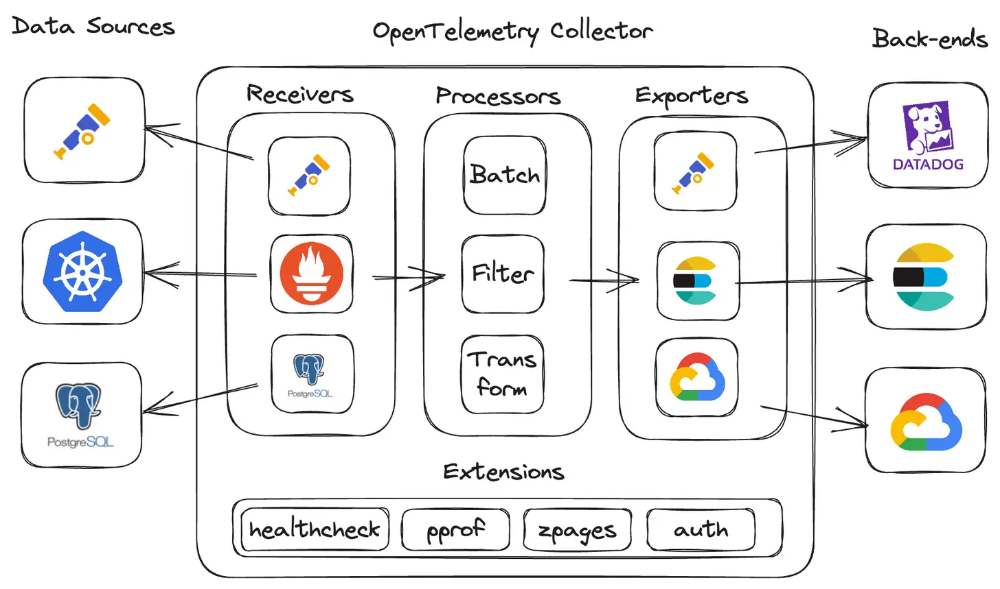


## Tích hợp vào K8S (sử dụng auto-instrumentation)

> Đơn giản thì đây là 1 phương pháp giúp tự động inject libs, dependecies, SDK vào ứng dụng mà không cần can thiệp vào mã nguồn.

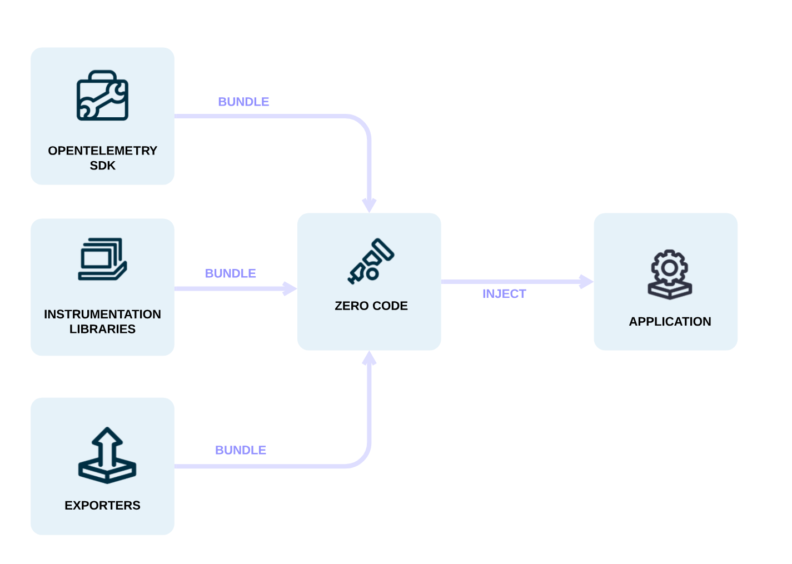

### Thông tin về ứng dụng

1. Lấy ví dụ về 1 ứng dụng chạy theo kiến trúc microservices như sau:

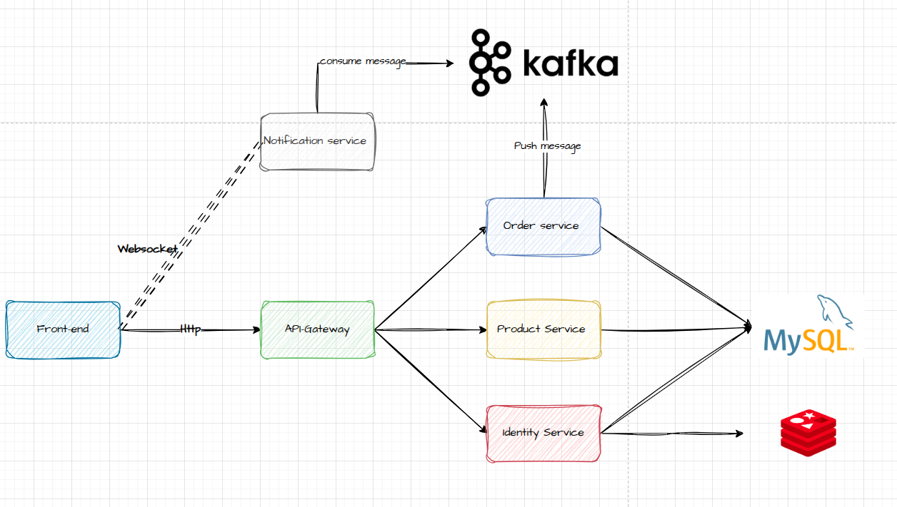


2. Ứng dụng bao gồm các services như:

- Api-gateway
- Product servcice 
- Order service 
- Identity service 
- **Notification service (riêng services này sẽ ko đi qua api gateway mà giao tiếp với frontend = websocket)**
- Front end
- DB: redis, mysql 
- Message Queue: Kafka

### Thiết lập các công cụ 

> Mô hình triển khai

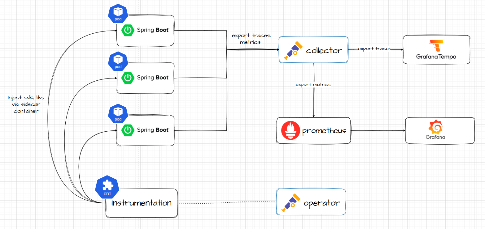

1. Prometheus Grafana

```bash 
kubectl create ns monitoring 
helm repo add bitnami https://charts.bitnami.com/bitnami
helm repo add prometheus-community https://prometheus-community.github.io/helm-charts
helm repo update
helm install kube-prometheus-stack prometheus-community/kube-prometheus-stack -n monitoring
```

2. Opentelemetry collector + operator

```bash 
cd ~/apm/helm

helm install otel-operator open-telemetry/opentelemetry-operator -f values-otel-operator.yaml -n monitoring

helm install otel-collector open-telemetry/opentelemetry-collector -f values-otel-collector.yaml -n monitoring
```

**Các điểm cần chú ý**
1. Nếu dùng file `values.yaml` mặc định của chart thì phải set images cho collector + operator ở phần

```bash 
# values-otel-operator.yaml
manager:
  image:
    repository: ghcr.io/open-telemetry/opentelemetry-operator/opentelemetry-operator
    tag: ""
  collectorImage:
    repository: "ghcr.io/open-telemetry/opentelemetry-collector-releases/opentelemetry-collector-k8s"
    tag: 0.124.1
```    

```bash 
# values-otel-collector.yaml
image:
  # Sử dụng images contrib (bắt buộc)
  repository: "ghcr.io/open-telemetry/opentelemetry-collector-releases/opentelemetry-collector-contrib"
```

2. Config `port`, `receiver`, `exporter` trong **values-otel-collector.yaml**:

```bash 
config:
  exporters:
    prometheus:
      endpoint: ${env:MY_POD_IP}:8889
    otlp:
      endpoint: "tempo-distributor:4317" # gửi traces qua tempo thông qua service-name
      tls:
        insecure: true

  receivers:
    otlp:
      protocols:
        grpc:
          endpoint: 0.0.0.0:4317 # cho phép nhận data từ các nguồn qua gRPC
        http:
          endpoint: 0.0.0.0:4318 # cho phép nhận data từ các nguồn qua Http


# Đây sẽ là port để export metrics sang backend, mặc định phần này cần được enable trong helm chart nếu muốn bắn metrics sang back-end. Có thể để là port bao nhiêu cũng được, default protocol là TCP. 

ports:
  ...
  metrics:
    # The metrics port is disabled by default. However you need to enable the port
    # in order to use the ServiceMonitor (serviceMonitor.enabled) or PodMonitor (podMonitor.enabled).
    enabled: true
    containerPort: 8889 
    servicePort: 8889
    protocol: TCP
```      


> Chạy lệnh sau trong 1 pod bất kỳ để check xem collector có thu được metrics hay không

```bash 
curl http://{OTEL_COLLECTOR_SERVICE_NAME}.{NAMESPACE}.svc.cluster.local:8889/metrics
```
**Endpoint để scrape metrics mặc định sẽ là `/metrics`**


3. Kafka + Zookeeper

> Các điểm cần chú ý
1. Sửa lại **storageclass** trong file `kafka-values.yaml` theo storageclass của cụm đang dùng.
2. Sau khi chạy xong lệnh `helm install kafka` sẽ phải làm 1 bước là tạo file `client.properties` rồi copy vào pod kafka client để test-connection (step này sẽ được hiển thị chi tiết sau khi cài đặt kafka chart thành công).

```bash 
helm install kafka bitnami/kafka -f kafka-values.yaml -n monitoring 
helm install zookeeper bitnami/zookeeper -f values-zkp.yaml -n monitoring 
```


4. Tempo

```bash 
helm install tempo grafana/tempo-distributed -f values-tempo.yaml -n monitoring
```


#### Kết quả
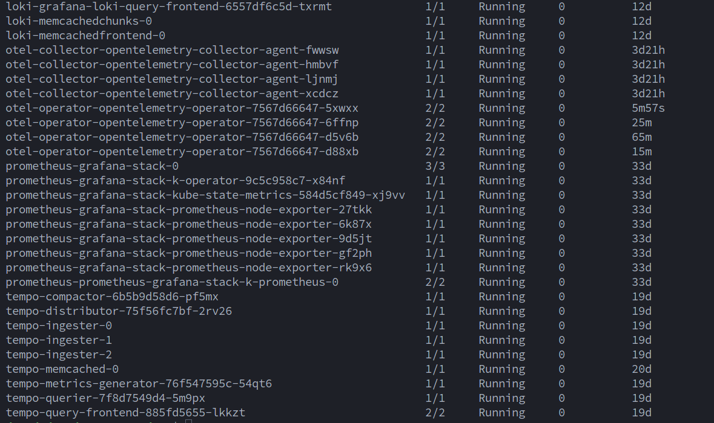


### Khởi chạy ứng dụng

1. Chạy các file yaml của từng services:

**Lưu ý:**
1. Apply file `otelinst.yaml` đầu tiên sau đó apply các file còn lại.
2. Chỉnh lại host trong các file yaml dành cho `ingress`.
3. Sau khi pod mysql chạy lên thì thực thi file SQL  trong thư mục `app`

```bash 
cd ~/apm/k8s

kubectl create ns microsvc 

kubectl apply -f otelinst.yaml # bắt buộc phải apply file này đầu tiên

kubectl apply -f .

```

2. Kết quả
```bash 
datnd@datnd-master-node:~$ kgp -n microsvc
NAME                                    READY   STATUS    RESTARTS         AGE
api-gateway-54dfd76499-6nkrn            1/1     Running   1 (3d22h ago)    4d22h
api-gateway-54dfd76499-hrd9c            1/1     Running   0                4d22h
ecom-fe-659fd86cd5-2vvrg                1/1     Running   0                4d22h
ecom-fe-659fd86cd5-fwt22                1/1     Running   0                4d22h
identity-service-66b9c9dbdb-599dx       1/1     Running   0                4d22h
identity-service-66b9c9dbdb-dwtz5       1/1     Running   0                4d22h
kafka-broker-0                          1/1     Running   42 (77m ago)     6d5h
kafka-broker-1                          1/1     Running   51 (135m ago)    7d22h
kafka-broker-2                          1/1     Running   46 (3h46m ago)   7d22h
mysql-0                                 1/1     Running   0                3d23h
notification-service-6d495c789b-4zg79   1/1     Running   0                4d22h
notification-service-6d495c789b-k6vzs   1/1     Running   0                4d22h
notification-service-6d495c789b-rjgg7   1/1     Running   0                4d22h
orders-service-74bdbb858d-4bxxq         1/1     Running   0                4d22h
orders-service-74bdbb858d-zk5n5         1/1     Running   0                4d22h
product-service-566fc6c7cb-fsdx6        1/1     Running   0                3d23h
product-service-566fc6c7cb-pcl5r        1/1     Running   0                3d23h
redis-0                                 1/1     Running   0                7d22h
zookeeper-0                             1/1     Running   0                7d22h
```

3. Check xem các service có được instrumentation chưa

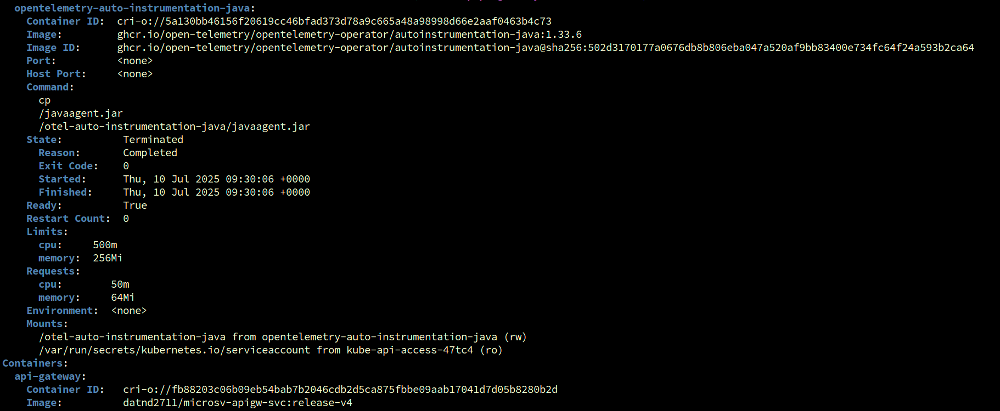
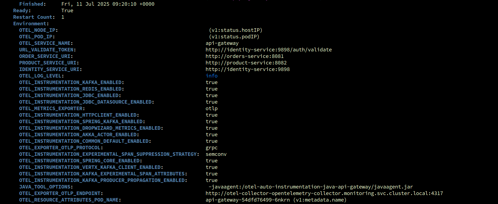

- Nếu deployment của các services có chứa các biến môi trường + images của các ngôn ngữ nghĩa là đã instrumentation thành công. 
- Về cơ bản thì instrumentation sẽ tạo ra 1 init container để inject các sdk, libs vào trong container chính (describe pod để thấy **path mount** libs, sdk vào trong container). 
- Việc này đảm bảo rằng ứng dụng có thể tự động sử dụng các sdk của otel mà không cần phải sửa mã nguồn (cách để inject là add **annotations** vào trong deployment, pod, statefulset,... tùy thuộc vào ngôn ngữ và framework mà ứng dụng đang chạy). Check các file deployment của services. 

> Chi tiết: [https://opentelemetry.io/docs/platforms/kubernetes/operator/automatic/](https://opentelemetry.io/docs/platforms/kubernetes/operator/automatic/)


**Giải thích về Instrumentation**

```yaml
apiVersion: opentelemetry.io/v1alpha1
kind: Instrumentation
metadata:
  name: java-instrumentation
  namespace: microsvc
spec:
  exporter:
    endpoint: http://otel-collector-opentelemetry-collector.monitoring.svc.cluster.local:4317
  propagators:
  - tracecontext
  - baggage
  sampler:
    type: parentbased_traceidratio
    argument: "1.0"
  java:
    env:
    - name: OTEL_LOG_LEVEL
      value: "info"
    - name: OTEL_INSTRUMENTATION_KAFKA_ENABLED
      value: "true"
    - name: OTEL_INSTRUMENTATION_REDIS_ENABLED
      value: "true"
    - name: OTEL_INSTRUMENTATION_JDBC_ENABLED
      value: "true"
    - name: OTEL_INSTRUMENTATION_JDBC_DATASOURCE_ENABLED
      value: "true"
    - name: OTEL_METRICS_EXPORTER
      value: otlp
    - name: OTEL_INSTRUMENTATION_HTTPCLIENT_ENABLED
      value: "true"
    - name: OTEL_INSTRUMENTATION_DROPWIZARD_METRICS_ENABLED
      value: "true"
    - name: OTEL_INSTRUMENTATION_COMMON_DEFAULT_ENABLED
      value: "true"
    - name: OTEL_EXPORTER_OTLP_PROTOCOL
      value: grpc
    - name: OTEL_INSTRUMENTATION_EXPERIMENTAL_SPAN_SUPPRESSION_STRATEGY
      value: "semconv"
    - name: OTEL_INSTRUMENTATION_SPRING_CORE_ENABLED
      value: "true"

```
1. Endpoint là địa chỉ mà app sẽ export metrics đến backend như prometheus, zipkin, Jaeger,... cụ thể ở đây ứng dụng cần 
xuất metrics, trace, logs sang opentelemetry-collector.
- `Port 4317`: Xuất data theo giao thức gRPC
- `Port 4318`: Xuất data sử dụng giao thức Http
2. **Propagators** quyết định context nào sẽ được truyền giữa các service.
- `tracecontext`: Chuẩn W3C Trace Context – sử dụng headers traceparent, tracestate để truyền trace-id, span-id, sampling flag… giữa các service
- `baggage`: Dùng để truyền metadata tuỳ ý (key/value) giữa các service cùng trace, ví dụ user_id, env, tenant_id, ...
3. **Sampler** quyết định có nên tạo trace cho request đó hay không (Quan trọng để kiểm soát lượng trace sinh ra, tránh overload hệ thống)
- `type: parentbased_traceidratio`: Nếu request có parent trace → theo quyết định của parent (sample hay không). Nếu không có parent → dùng traceid ratio sampling.
- `argument: "1.0"`: Tỷ lệ sampling nếu không có parent. 1.0 = 100%, 0.5 = 50%, 0 = không lấy.

 **Propagators và Sampler để thông số mặc định như trên không cần chỉnh sửa**

4. Đối với các biến env sẽ là điều quan trọng
- Khi sử dụng auto-instrumentation thì các biến môi trương sẽ là thành phần quan trọng để truy vết được request.
- Các biến môi trường được tạo ra với đủ các loại công nghệ để có thể trace 1 transactions sẽ phải làm các bước nào
- Ví dụ: app có mysql, kafka, redis thì sẽ inject các env tương ứng **OTEL_INSTRUMENTATION_KAFKA_ENABLED**, **OTEL_INSTRUMENTATION_REDIS_ENABLED**,...
- Lưu ý rằng mỗi framework và ngôn ngữ sẽ có cách implement instrumentation khác nhau. 
> Chi tiết: [https://opentelemetry.io/docs/zero-code/](https://opentelemetry.io/docs/zero-code/) 

5. Services triển khai ở namespace nào thì Instrumentation phải được tạo ở namespace đó.

## Kiểm tra traces, metrics qua Grafana

1. Connect Grafana đến Tempo

- Truy cập vào `datasources` trên sidebar ở giao diện Grafana sau đó `add new datasource`
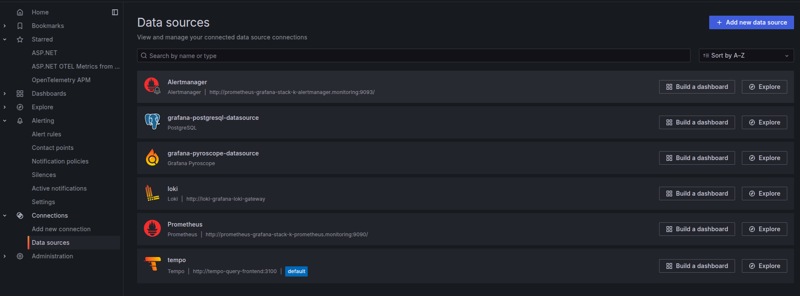

- Tìm kiếm `Tempo`, sau đó nhập tên service và port của tempo

```bash 
http://tempo-distributor:3100
```
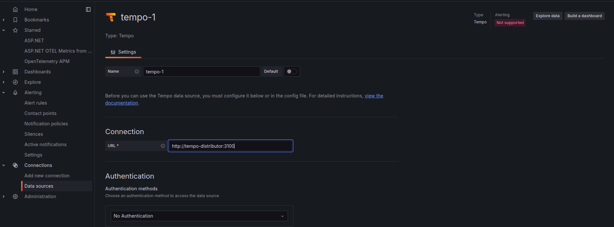

- Click `save & test`

2. Xem traces trên giao diện
- Click `explore` ở sidebar của Grafana
- Chọn datasource Tempo rồi xem trên UI

**Khi gửi request đến app thì các traces sẽ xuất hiện**
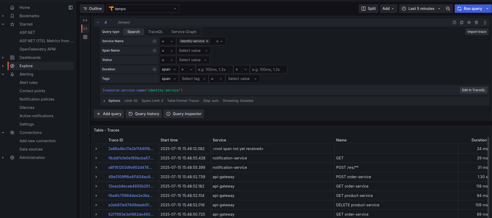

**Chi tiết 1 traces**
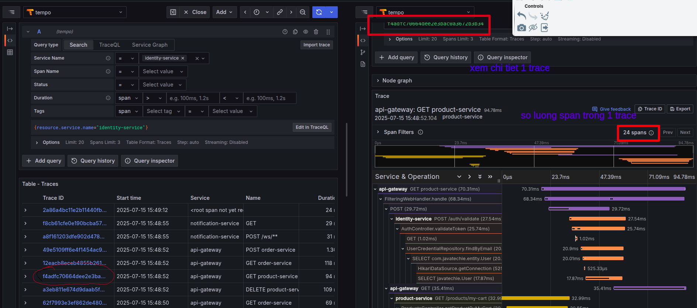

**Thông tin về 1 span**
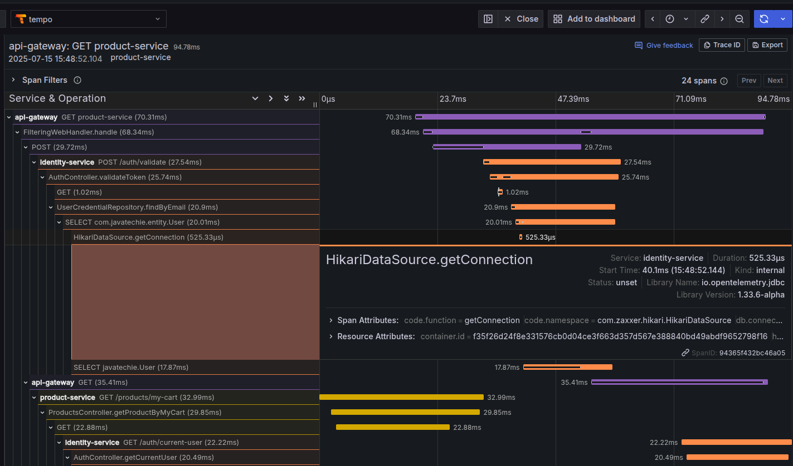

**Services Graph (Biểu đồ giao tiếp của các servicé)**
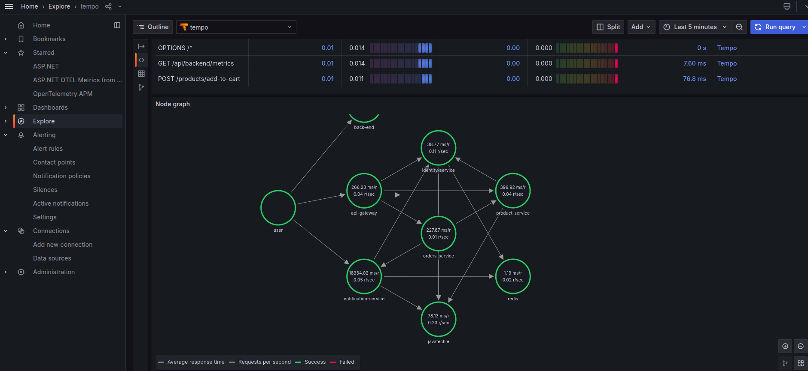

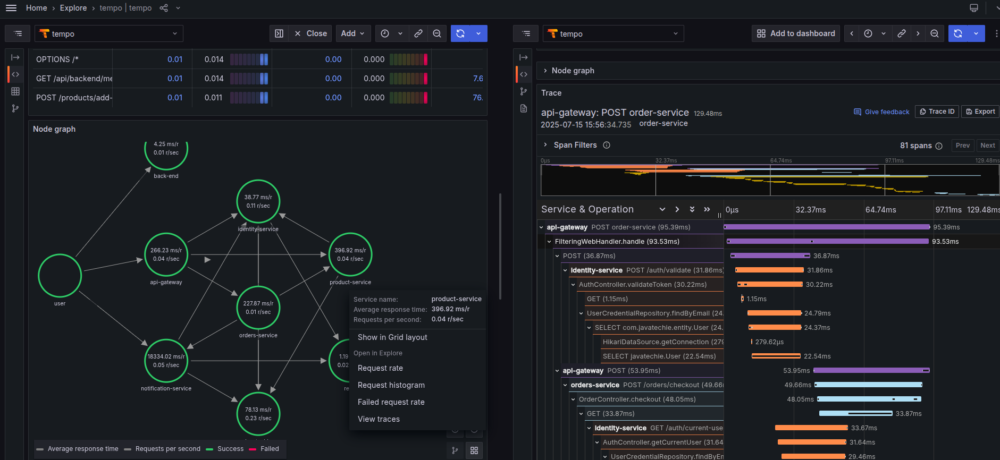

> Xem chi tiết traces có thể thấy rõ flow của 1 transactions đi từ đầu đến cuối như thế nào, tổng latency của 1 request, step nào bị chậm, cần tối ưu, tỷ lệ lỗi của request đó trong 1 khoảng thời gian,...

## Troubleshooting

1. Lỗi không instrumentation được
- Ví dụ describe deployment, pod không thấy có init container hoặc biến môi trường từ **Instrumentation**: `kubectl events` để check event của các resouces.
- Nếu get event chưa thấy có dấu hiệu bất thường thì khả năng Instrumentation bị config sai => Check lại file **Instrumentation** 
- Nếu describe deployment, pod vẫn chưa thấy được instrument -> xóa hết các deployment xóa Instrumentation sau đó apply lại theo thứ tự: Instrumentation rồi đến các file deployment.
- Check logs **otel-operator**:

```bash 
{"level":"ERROR","timestamp":"2025-07-15T09:40:13Z","logger":"instrumentation-upgrade","message":"failed to apply changes to instance","name":"java-instrumentation","namespace":"microsvc","error":"Internal error occurred: failed calling webhook \"minstrumentation.kb.io\": failed to call webhook:.......
```

> Lỗi này check lại config của Instrumentation.

2. Lỗi không connect được sang otel-collector

```c++ 
[otel.javaagent 2025-07-15 09:28:35:505 +0000] [OkHttp http://otel-collector-opentelemetry-collector.monitoring.svc.cluster.local:4318/...] WARN io.opentelemetry.exporter.internal.grpc.GrpcExporter - Failed to export spans. Server responded with gRPC status code 2. Error message: FRAME_SIZE_ERROR: 4740180
```

- Chỉnh lại endpoint sang port **4317(gRPC)** (đối với app java sẽ export qua gRPC, .NET http và các ngôn ngữ còn lại)

3. Lỗi metrics, trace đang gửi bình thường thì bị không thấy dữ liệu nữa 

- Ví dụ, dữ liệu đang hiển thị trên Grafana bình thường nhưng khoảng vài phút sau ko thấy gì nữa
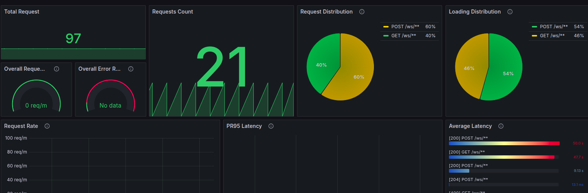

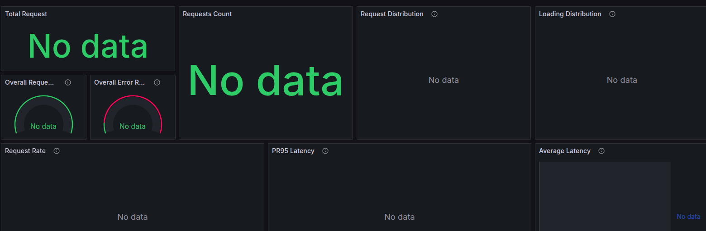

- Check thử metrics trên prometheus = cách chạy query bất kỳ 

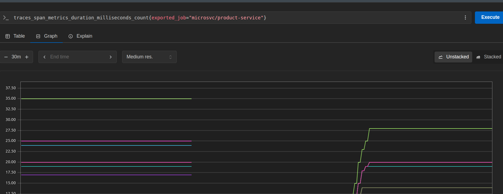

- Có dấu hiệu bị ngắt quãng -> checjk logs **otel-operator**

```bash 
{"level":"ERROR","timestamp":"2025-07-15T09:40:22Z","message":"failed to select an OpenTelemetry Collector instance for this pod's sidecar","namespace":"myapp","name":"","error":"no OpenTelemetry Collector instances available","stacktrace":"github.com/open-telemetry/opentelemetry-operator/pkg/sidecar.(*sidecarPodMutator).Mutate\n\t/home/runner/work/opentelemetry-operator/opentelemetry-operator/pkg/sidecar/podmutator.go:73\ngithub.com/open-telemetry/opentelemetry-operator/internal/webhook/podmutation.(*podMutationWebhook).Handle\n\t/home/runner/work/opentelemetry-operator/opentelemetry-operator/internal/webhook ....
```

> Nếu có log lỗi như trên thì xóa pod operator đó đi nên setup cronjob tự động check lỗi rồi xóa 10p 1 lần

# Kết luận
1. Tracing chỉ phù hợp với ứng dụng sử dụng Kiến trúc `Microservice` và `CQRS` khi có nhiều services giao tiếp chồng chéo nhau khiến cho 1 transactions trở nên phức tạp, khó traces lỗi. Nếu app dạng monolith chỉ có FE, BE và DB thì ko cần thiết.

> Trace cho app fullstack sẽ chỉ có như này, hoàn toàn thừa thãi và không cần thiết

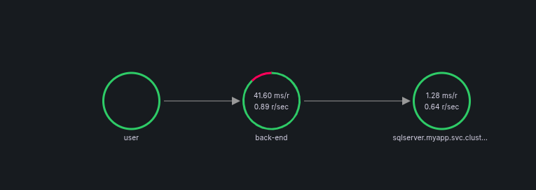


2. Nên setup **Traces backend** chạy **standalone server** thay vì deploy trên k8s (ví dụ Zipkin, Jaeger) vì mục đích lưu trữ lâu dài (các backend này yêu cầu object store như: S3, minio)